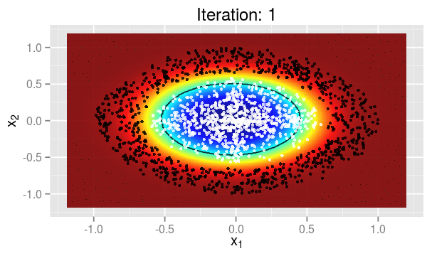

Bayesian Classification with Regularized Gaussian Models
========================================================

This work presents a novel approach to reduce the effects of the violations of the attribute independence assumption on which the Gaussian naive Bayes classifier is based. A Regularized Gaussian Bayes (RGB) algorithm is introduced, that considers the correlation structure among variables to learn the class posterior probabilities. The proposed RGB classifier avoids overfitting by replacing the sample covariance estimate with well-conditioned regularized estimates. So, RGB aims to find the best trade-off between non-naivety and prediction accuracy.

Moreover, improvements in RGB accuracy and stability are achieved using Adaptive Boosting (AdaBoost). In short, the proposed Boosted RGB (BRGB) classifier generates a sequentially weighted set of RGB base classifiers that are combined to form a robust classifier. Classification experiments have demonstrated that the BRGB achieves prediction performance comparable to the best off-the-shelf ensemble based architectures, such as Random Forests, Extremely Randomized Trees (ExtraTrees) and Gradient Boosting Machines (GBMs), using few (10 to 20) base classifiers.

